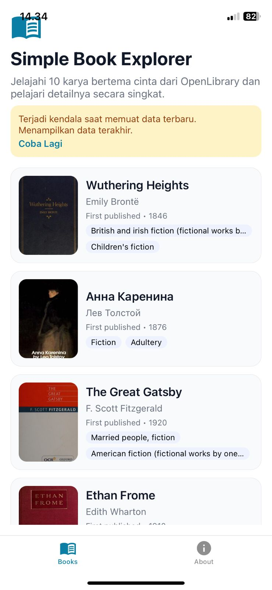
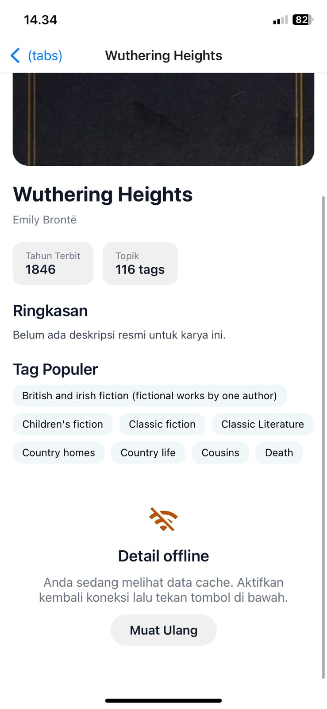

# Simple Book Explorer

A lightweight React Native/Expo application that consumes OpenLibrary's `love` subject feed (`https://openlibrary.org/subjects/love.json?limit=10`). Proyek ini dibuat untuk menyoroti kemampuan penanganan data, pemisahan logika, dan kesiapan offline pada aplikasi mobile.

## Arsitektur & Flow

- **Entry & Navigasi**: Expo Router dengan struktur `app/` memisahkan tab utama (Books/ About) serta layar detail `/book/[workId]`.
- **Data Layer**: `features/books/api/book-service.ts` memanggil OpenLibrary melalui helper `lib/http/open-library.ts`. Seluruh pemasok data bersifat stateless dan mudah diuji.
- **Hooks**: `useBooks` menangani fetch list, state loading/refresh, retry, serta cache sederhana. `useBookDetail` menangani penggabungan data awal dari list dengan detail API tanpa melakukan refetch ketika offline.
- **UI**: `app/(tabs)/index.tsx` dan `app/book/[workId].tsx` berisi layout utama. Komponen `FeedbackState` dipakai ulang untuk empty/error/offline state agar penanganan jaringan konsisten.
- **Error Handling**: Setiap request dibungkus `HttpError` dengan mapping ke pesan user-friendly. Saat koneksi mati, pengguna melihat pesan "koneksi terputus" dan tombol retry tanpa crash.

## Fitur Utama

- Daftar buku dengan cover, penulis, tahun, dan tag (10 item dari query love).
- Layar detail dengan cover besar, badge informasi, dan deskripsi yang disatukan dengan data list agar tetap tampil meski offline.
- Pull-to-refresh dan tombol retry untuk memastikan alur testing sesuai requirement offline.
- Struktur file modular (api/hooks/utils) sehingga reviewer cepat memahami tanggung jawab tiap bagian.

## Dokumentasi Visual

- **Beranda (List Buku)** – `assets/images/tmpilan-depan.jpeg` memperlihatkan `FlatList` dengan banner fallback ketika terjadi error, mencerminkan state handling.

  

- **Detail Buku & Offline State** – `assets/images/detail.jpeg` menunjukkan badge info, daftar tag, dan komponen retry yang muncul saat offline.

  

## Menjalankan Proyek

```bash
npm install
npm run start
```

Pilih target (QR/iOS/Android/Web) melalui CLI Expo.

## Catatan Tambahan

- Cover image memakai CDN `covers.openlibrary.org` ukuran `-M` untuk list dan `-L` untuk detail.
- Seluruh UI memakai komponen bawaan RN + `expo-image`, tanpa theming custom agar file tetap ringkas.
